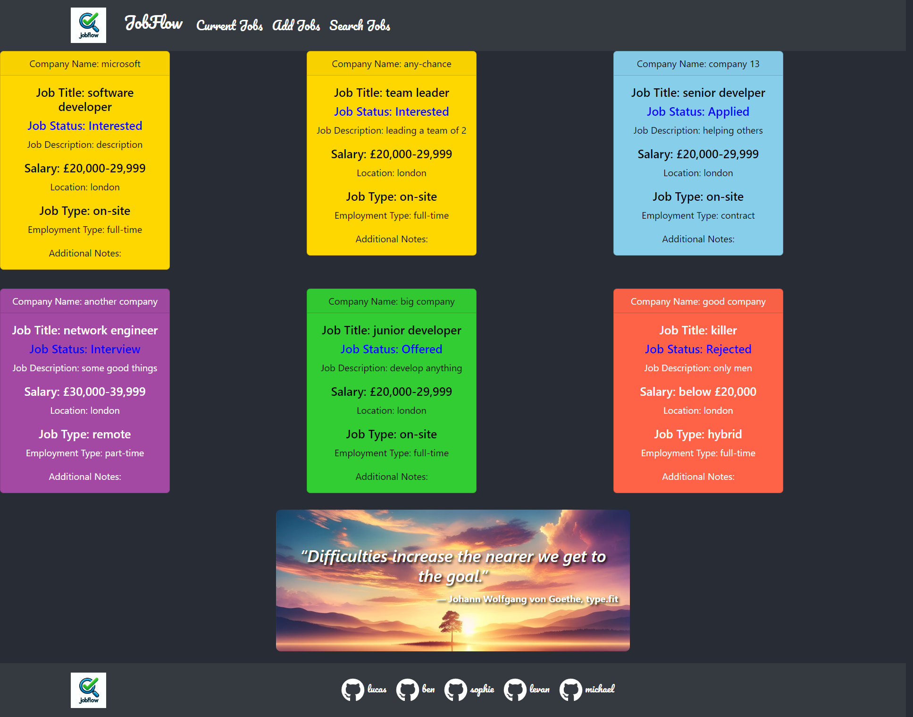

# Finale: JOB FLOW 

## Table of Contents

* [Introduction](#introduction)
* [Presentation](#presentation)
* [Installation](#installation)
* [Usage](#usage)
* [Features](#features)
* [Credits](#credits)
* [Contribution](#contribution)
* [Tests](#tests)
* [License](#license)

## Introduction

This is the second and final group project for the front-end web development bootcamp. 

Our group has used everything we have learned to create a real-world front-end application that we will be able to showcase to potential employers. Projects have played a key role in your journey to becoming a front-end web developer. This project is a fantastic opportunity to show employers our collaborative skills and coding abilities, especially in the context of a scalable, user-focused React app. 

We conceive and execute a design that solves a real-world problem. In creating this collaborative front-end, application, we’ll create a React front end to build a user-focused platform. We’ll continue to build on the agile development methodologies. These include storing code in GitHub, managing with a project management tool, and implementing feature and bug fixes using the Git branch workflow and pull requests.

For this project, we start from scratch. Doing so will allow us to revisit your front-end abilities in the context of React. 

APIs: final ones used.

`User Story:`  
`As a job seeker after a bootcamp,`  
`I want a platform where I can not only search for relevant job opportunities but also track my job applications and progress,`  
`So that I can manage my job search more efficiently and increase my chances of landing a job that matches my skills and aspirations.`  

Link to the deployed application: https://main--job-flow-app.netlify.app/

## Presentation: 

1. Elevator pitch: a one minute description of your application.
2. Concept: What is your user story? What was your motivation for development?
3. Process: What were the technologies used? How were tasks and group roles broken down and assigned? What challenges did you encounter? What were your successes?
4. Demo: Show your stuff!
5. Directions for future development
6. Links to to the deployed application and the GitHub repository

## Installation

For setting up the development environment:

1. Clone the repository to your local machine.
2. Open the HTML, CSS, and JavaScript files in a code editor like VS Code.
3. Make sure to install Bootstrap for responsive design.
4. Use Git for version control and commit your changes to GitHub.
5. Build react app with following commands: 

`npm start`
`npm test`
`npm run build`
`npm run eject`

## Usage 

jobflow simplifies job hunting and application tracking. The main sections include:

1. Navigation Bar: on all 3 pages- Current Jobs, Add Jobs, Search Jobs. 
2. Home page: Current Jobs- job status of the list of jobs added including those on watchlist and during interview stage; + a motivation quote section at the bottom of the page. 
3. Job form page: Add Jobs- jobs interested, applied and interview stage. 
4. Job search page: Search Jobs- search bar for job title, location, salary range, and job type. 
5. Footer: Links to contributors' github. 

The following animation demonstrates the application functionality:

## Features

Use React.
Use Node.js.
Have both GET and POST routes for retrieving and adding new data.
Be deployed using Netlify.
Use at least two libraries, packages, or technologies that we haven't discussed.
Have a polished front end/UI.

## Credits

1) TA: Jack Labukas, Martin William 
2) Instructor: Laura Cole
3) Group members: ​Sophie Ebsworth, Ben Sadler, Michael Erg, Levan Burchuladze
4) Resources: Rapid API, W3 Schools, Stackover Flow, ChatGPT 

## Contribution

Please contribute direclty as you wish. 

## Tests

1. All links and images are fully functional.
2. Responsive design tested across multiple devices and browsers.

## License

NIL 

---
© 2024 edX Boot Camps LLC. Confidential and Proprietary. All Rights Reserved.
